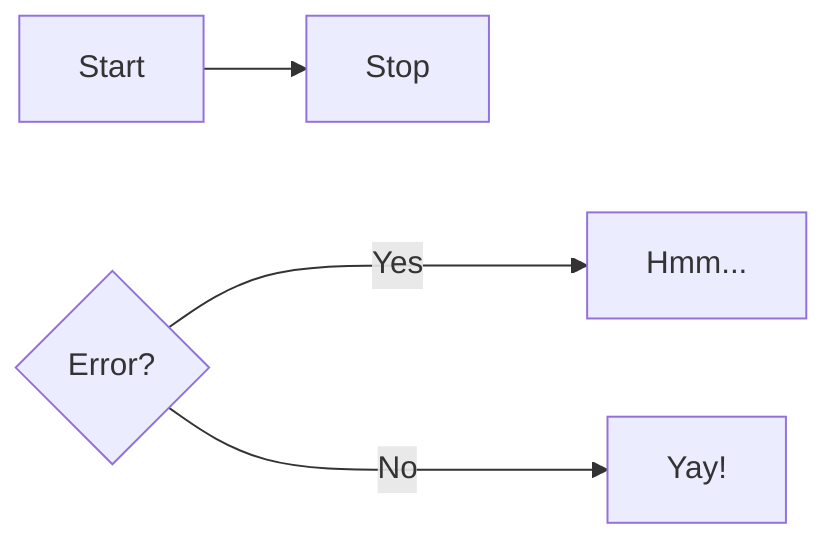

Markdown 示例。

---

<!-- more -->

## Admonitions 告示

> 也叫： call-outs

参考：

- [Material for MkDocs, Admotions](https://squidfunk.github.io/mkdocs-material/reference/admonitions/)
- [PyMdown Extensions, Admonition](https://facelessuser.github.io/pymdown-extensions/extensions/blocks/plugins/admonition/)
- [Docusaurus, Admonitions](https://docusaurus.io/docs/markdown-features/admonitions)
- [Obsidian, Callouts](https://help.obsidian.md/Editing+and+formatting/Callouts)

例子：

!!! note "标题"

    告示内容，需要开启`Admonition`。

    基本语法：

    {!!!|???} {note,abstract,info,tip,success,question,warning,failure,danger,bug,example,quote} "标题"

??? note

    这是一个关闭的告示，需要开启`Details`。

## Code blocks 代码块

- 代码块：设置标题、行号、高亮行

```python title="bubble_sort.py" linenums="1" hl_lines="4 5"
def bubble_sort(items):
    for i in range(len(items)):
        for j in range(len(items) - 1 - i):
            if items[j] > items[j + 1]:
                items[j], items[j + 1] = items[j + 1], items[j]

# theme:
#   features:
#     - content.code.annotate
# markdown_extensions:
#   - pymdownx.snippets
```

## Tabs 标签页

- 标签页

=== "C"

    ``` c
    #include <stdio.h>

    int main(void) {
      printf("Hello world!\n");
      return 0;
    }
    ```

=== "Markdown List"

    1. Sed sagittis eleifend rutrum
    2. Donec vitae suscipit est
    3. Nulla tempor lobortis orci

        * Sed sagittis eleifend rutrum
        * Donec vitae suscipit est

=== "Ordered List"

    ``` markdown
     * Sed sagittis eleifend rutrum
     * Donec vitae suscipit est
     * Nulla tempor lobortis orci
    ```

=== "Admotion"

    !!! example

        This is en example!

## Tables 表格

- 启用可排序表格

| Method   | Description                          |
| -------- | ------------------------------------ |
| `GET`    | :material-check: Fetch resource      |
| `PUT`    | :material-check-all: Update resource |
| `DELETE` | :material-close: Delete resource     |

- 从文件导入

{{ read_csv("../images/movies.csv") }}

## Diagrams 图表

文档 [Mermaid.js 文档](https://mermaid.js.org/intro/)

- 流程图：



## More 其他

- 文本标记：
  - Addition `{++ ++}`: text {++added++}
  - Deletion `{-- --}`: text {--deleted--}, ~~This was deleted~~
  - Substitution `{~~ ~> ~~}`: text {~~one~>a single~~}
  - Comment `{>> <<}`: text {>>and comments can be added inline<<}
  - Highlight ` {== ==}``{>> <<} `: ==This was marked==, {==Highlighting==}
  - ^^This was inserted^^
  - H~2~O
  - A^T^A
- Annotaions
- Buttons
- Grids: `<div class="grid cards" markdown> ... </div>`
- Tooltips: `content.tooltips`
