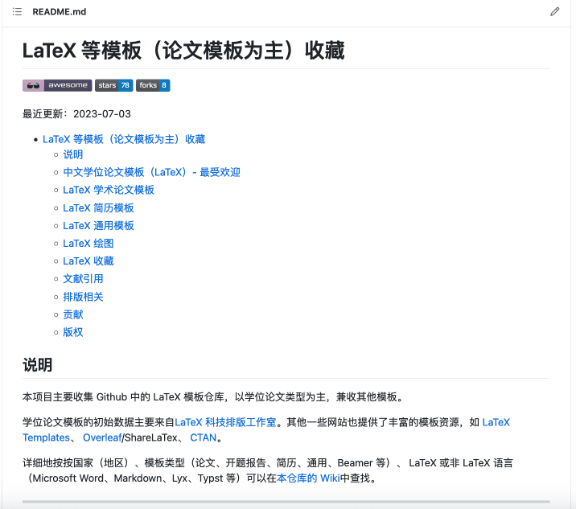
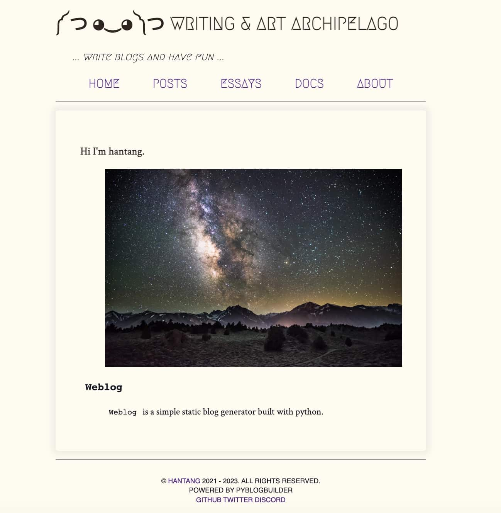

# Projects

## latex templates (collect)

> LaTeX 等模板（论文模板为主）收藏

<figure markdown>
  { width="450" loading=lazy }
  <figcaption><a href="https://github.com/hantang/latex-templates">latex templates</a></figcaption>
</figure>

## weblog (project)

<figure markdown>
  { width="450" loading=lazy }
  <figcaption><a href="https://github.com/hantang/weblog">Python Blog Builder</a></figcaption>
</figure>

## cinephile (movie list)

<figure markdown>
  { width="450" loading=lazy }
  <figcaption><a href="https://hantang.github.io/cinephile">电影榜单</a></figcaption>
</figure>

## gate.guokr (mirror site)

<figure markdown>
  { width="450" loading=lazy }
  <figcaption><a href="https://github.com/hantang/wayback-gate-guokr/">果壳任意门（镜像备份）</a></figcaption>
</figure>

## mooc (mirror sites collect)

<figure markdown>
  { width="450" loading=lazy }
  <figcaption><a href="https://github.com/hantang/wayback-mooc">一些在线公开课程网站镜像备份。</a></figcaption>
</figure>
