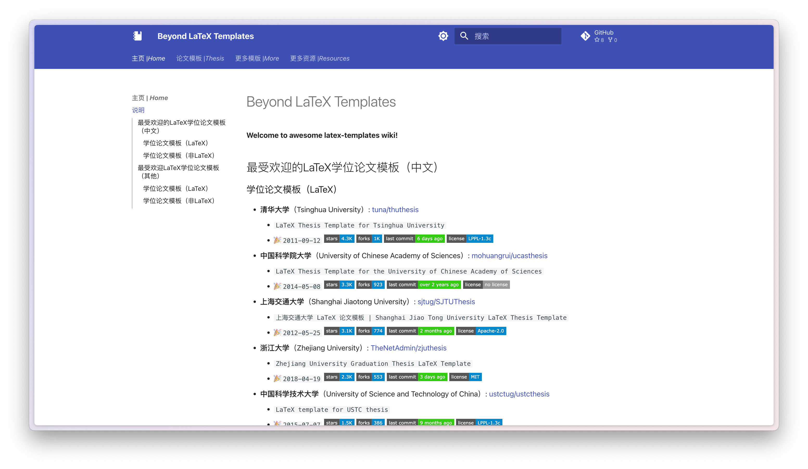
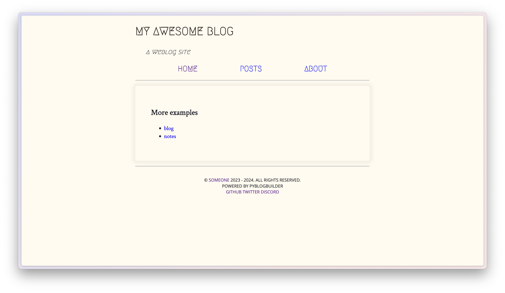

---
search:
  exclude: true
icon: material/view-list
---

# :rocket: Projects

<figure markdown="span">
  { width="350" loading=lazy}
</figure>

---

<!-- more -->

## latex templates (awesome collect)

> LaTeX 等模板（论文模板为主）收藏

<figure markdown="span">
  { width="450" loading=lazy }
  <figcaption><a href="https://hantang.github.io/latex-templates">latex templates</a></figcaption>
</figure>

## cinephile (movie list)

> 豆瓣（douban.com）、IMDb（imdb.com）、时光网（mtime.com）、猫眼（maoyan.com）、TMDb（themoviedb.org）Top 250 / Top 100 电影定时抓取

<figure markdown="span">
  { width="450" loading=lazy }
  <figcaption><a href="https://hantang.github.io/cinephile">电影榜单</a></figcaption>
</figure>

## linux from scratch (LFS) scripts

> Linux From Scratch scripts

<figure markdown="span">
  <figcaption><a href="https://github.com/hantang/linuxfromscratch-scripts">LFS脚本</a></figcaption>
</figure>

## weblog (blog site)

> A python static blog generator. **WIP**

<figure markdown="span">
  { width="450" loading=lazy }
  <figcaption><a href="https://hantang.github.io/weblog">Python Blog Builder</a></figcaption>
</figure>
