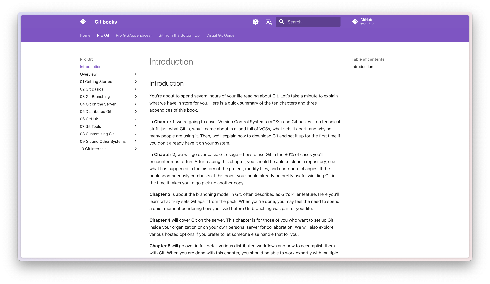

# :alembic: Wayback Series

<figure markdown="span">
  { width="350" loading=lazy}
</figure>

---

<!-- more -->

## Mirror Backup

## gate.guokr

<figure markdown="span">
  { width="450" loading=lazy }
  <figcaption>果壳任意门（镜像备份） <a href="https://hantang.github.io/wayback-gate-guokr/">👉👉</a></figcaption>
</figure>

## reference(cheatsheets.zip)

<figure markdown="span">
  { width="450" loading=lazy }
  <figcaption>CheatSheets.zip（镜像备份） <a href="https://hantang.github.io/wayback-reference/">👉👉</a></figcaption>
</figure>

## rsshub (documents only)

<figure markdown="span">
  { width="450" loading=lazy }
  <figcaption>RssHub文档（镜像备份） <a href="https://hantang.github.io/wayback-rsshub-doc/">👉👉</a></figcaption>
</figure>

## Powered By `Mkdocs`

## stanford ufldl

<figure markdown="span">
  { width="450" loading=lazy }
  <figcaption>Stanford | 机器学习/深度学习课程（吴恩达） <a href="https://hantang.github.io/wayback-ufldl/">👉👉</a></figcaption>
</figure>

<figure markdown="span">
  { width="450" loading=lazy }
</figure>
<figure markdown="span">
  { width="450" loading=lazy }
</figure>

## mit missing semester

wayback-missing-semester

<figure markdown="span">
  { width="450" loading=lazy }
  <figcaption>MIT | 计算机教育中缺失的一课（2019-2020） <a href="https://hantang.github.io/wayback-missing-semester/">👉👉</a></figcaption>
</figure>

## linux.cn (not official) archive

<figure markdown="span">
  { width="450" loading=lazy }
  <figcaption>Linux中国（王兴宇、王兴江）文章归档（2011-2024） <a href="https://hantang.github.io/wayback-linuxcn-archive/">👉👉</a></figcaption>
</figure>

## git books

<figure markdown="span">
  { width="450" loading=lazy }
  <figcaption>Git books： Pro Git, Git from the Bottom Up ... <a href="https://hantang.github.io/wayback-git-books/">👉👉</a></figcaption>
</figure>

## git emojis

<figure markdown="span">
  { width="450" loading=lazy }
  <figcaption>Git + Emojis <a href="https://hantang.github.io/wayback-git-books/">👉👉</a></figcaption>
</figure>
