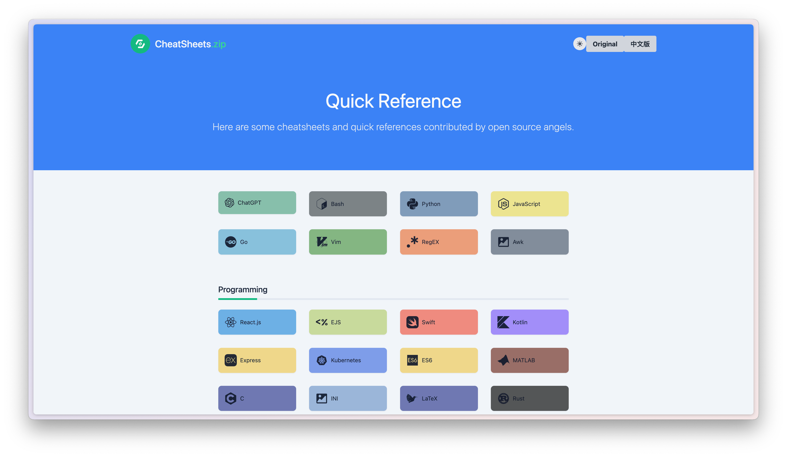
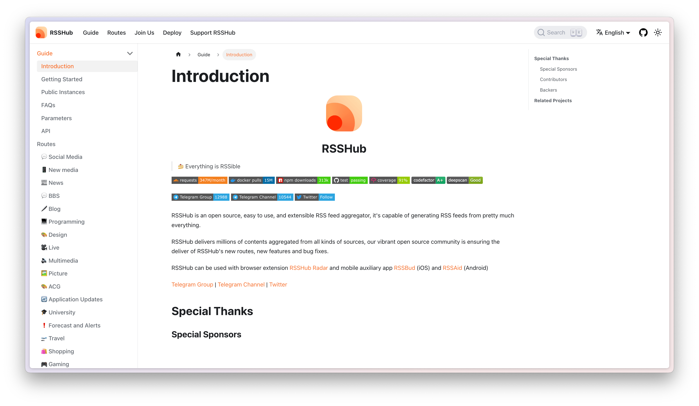
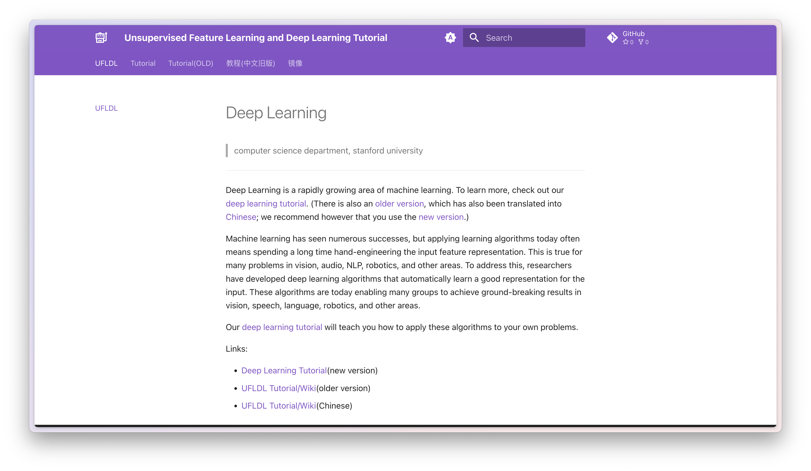
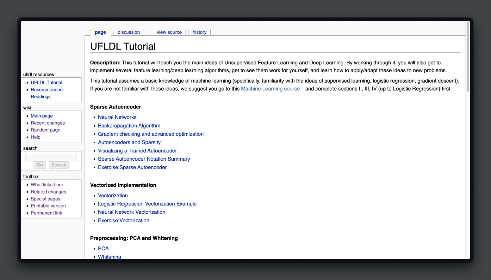
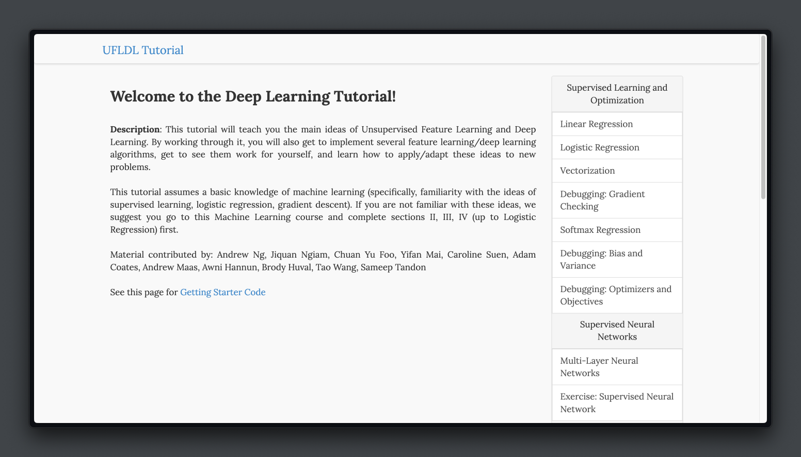
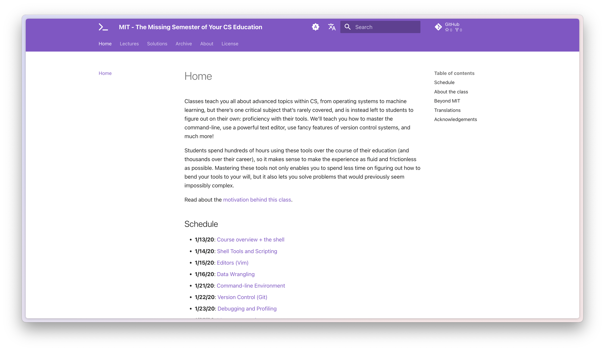
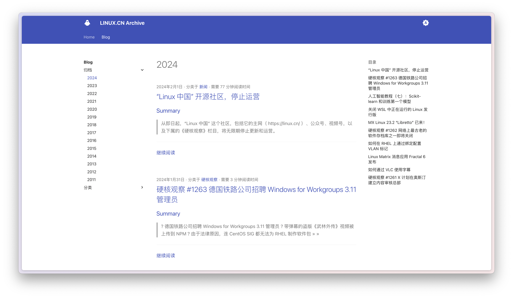

# :alembic: Wayback Series

<figure markdown="span">
  { width="350" loading=lazy}
</figure>

---

<!-- more -->

## Mirror Backup

## gate.guokr

<figure markdown="span">
  { width="450" loading=lazy }
  <figcaption><a href="https://github.com/hantang/wayback-gate-guokr/">果壳任意门（镜像备份）</a></figcaption>
</figure>

## reference(cheatsheets.zip)

<figure markdown="span">
  { width="450" loading=lazy }
  <figcaption><a href="https://github.com/hantang/wayback-reference/">CheatSheets.zip（镜像备份）</a></figcaption>
</figure>

## rsshub (documents only)

<figure markdown="span">
  { width="450" loading=lazy }
  <figcaption><a href="https://github.com/hantang/wayback-rsshub-doc/">RssHub文档（镜像备份）</a></figcaption>
</figure>

## Powered By `Mkdocs`

## stanford ufldl

<figure markdown="span">
  { width="450" loading=lazy }
  <figcaption><a href="https://github.com/hantang/wayback-ufldl/">Stanford | 机器学习/深度学习课程（吴恩达）</a></figcaption>
</figure>

<figure markdown="span">
  { width="450" loading=lazy }
</figure>
<figure markdown="span">
  { width="450" loading=lazy }
</figure>

## mit missing semester

wayback-missing-semester

<figure markdown="span">
  { width="450" loading=lazy }
  <figcaption><a href="https://github.com/hantang/wayback-missing-semester/">MIT | 计算机教育中缺失的一课（2019-2020）</a></figcaption>
</figure>

## linux.cn (not official) archive

<figure markdown="span">
  { width="450" loading=lazy }
  <figcaption><a href="https://github.com/hantang/wayback-linuxcn-archive/">Linux中国（王兴宇、王兴江）文章归档（2011-2024）</a></figcaption>
</figure>
